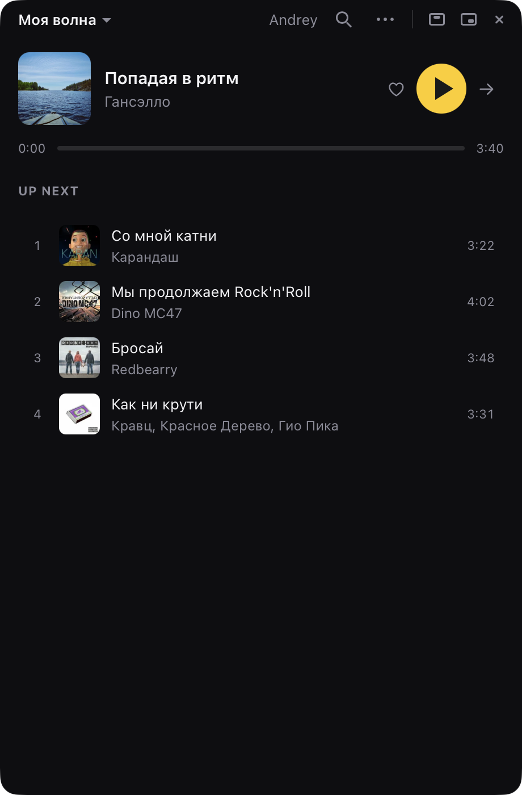
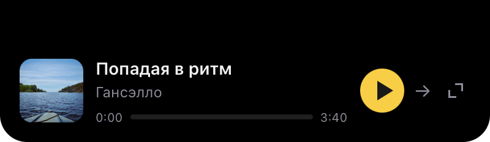

# Riflu

A small, clean, **unofficial** desktop player for Yandex Music. Blazing fast,
no ads, no useless animations, and native macOS integration right up to the
notch.

<p align="center">
  
</p>

<p align="center">
  <br>
  
</p>

Unofficial and not affiliated with Yandex. You need your own Yandex account
(Plus, for full tracks rather than 30-second previews).

## What it does

Plays **Моя волна**, or any of the ~700 other rotor stations (genres, moods,
activities, `personal:*`) picked from the wave list in the title bar. The
window is frameless, with the wave name sharing the row with the traffic
lights — drag it by that bar or by the now-playing row. Width is fixed and
fullscreen is off; it resizes vertically only. It can float above other apps or
shrink to a **mini player**: no window chrome at all, just "title · artist"
with the progress bar under it and the controls beside, in 420×66. Both live in
Settings and survive a restart, as does the chosen wave.

The mini player has no close button — the ⧉ button on its right restores the
full window, and ⌘Q still quits. Its rounded corners need a transparent
window, which is why `macOSPrivateApi` is on.

## Why a desktop app and not a web page

Yandex's API allowlists exactly one browser origin — the official player.
Any other origin gets no `Access-Control-Allow-Origin` header, so a static web
app simply cannot call it. Tauri gives us a native HTTP client that isn't
subject to CORS. See [ANALYSIS.md](ANALYSIS.md).

## Running

```bash
make deps
make dev
```

`make` on its own lists every task: `check`, `test`, `probe`, `mac`, `dmg`,
`install`, `windows`, `clean`.

Sign in with the device-code flow: the app shows a short code, you confirm it
at `ya.ru/device` in your real browser. Your password never touches this app.

The resulting token is written next to the settings, in the per-user config
directory — `~/Library/Application Support/ru.fanyagin.riflu/token.json` on
macOS (mode 0600), `%APPDATA%\ru.fanyagin.riflu\token.json` on Windows.
Treat that file as the credential it is: anything running as your user can read
it, and it grants full API access to your account until revoked at
[yandex.ru/security/apps](https://yandex.ru/security/apps). Delete the file (or
use **Sign out**) to remove the local copy.

> The consent screen says **“Yandex Music”**, not “Riflu”. Yandex does not let
> third parties register an OAuth application, so every unofficial client
> presents the official app's `client_id`. This is the honest cost of the
> project — see ANALYSIS.md §1.

## CI

`.gitea/workflows/build.yml` builds both platforms on push to `main`, on `v*`
tags, and on demand, uploading a Windows `*-setup.exe` and a zipped macOS
`.app`. Each job needs a Gitea runner registered with the matching label
(`windows-latest` / `macos-latest`) in **host** mode — a Docker label will not
do, since both builds need the platform SDK and webview on the machine itself.

Both jobs are native-arch and ad-hoc signed, so the artifacts are fine for your
own machines and Gatekeeper-blocked on anyone else's.

## Releases

Publishing a GitHub release runs `.github/workflows/release.yml`, which builds
a universal macOS `.app` (zipped) and a Windows NSIS installer and attaches both
to the release. The version is taken from the tag (`v1.2.3` → `1.2.3`), so the
tag must be semver. Builds are unsigned: on macOS open the app with right-click
→ Open the first time; on Windows SmartScreen will warn about an unknown
publisher.

## Platforms

Runs on macOS and Windows. The notch island is macOS-only; the rest works the
same on both, with a few differences:

- **Windows cannot be built from macOS.** Tauri needs the MSVC toolchain, the
  Windows SDK and WebView2 — even `cargo check --target x86_64-pc-windows-msvc`
  stops at the missing `llvm-rc`. `make windows` refuses to run anywhere but a
  Windows host.
- The app draws its own window buttons at the right of the top bar on both
  platforms. Windows drops the native decorations entirely; macOS keeps its
  frame (shadow, corners, resizing) with the traffic lights hidden. `<html>`
  carries `data-os` for the few platform-only controls.
- "Live in the menu bar" becomes "Live in the tray" and hides the taskbar
  button instead of the Dock icon.
- No app menu on Windows: Tauri only installs one on macOS, and half the items
  in `menu.rs` are macOS-only anyway.
- **Unverified:** the window is `transparent` (the macOS mini player needs it
  for its corner radius). That should be harmless on Windows, since `#app`
  paints an opaque background over the whole client area — but it wants a look
  on a real machine.

## Checking the API without the UI

```bash
make probe
```

Signs in (or reuses the stored token), then verifies an account lookup, a
wave batch, and that a resolved stream URL actually serves bytes. Run this
first when something breaks — it isolates the API from the UI.

## How it's put together

```
src/            frontend — owns the <audio> element and nothing else
src-tauri/src/
  auth.rs       OAuth device-code flow
  store.rs      token in a 0600 file
  api.rs        typed API client; one place refreshes on 401
  media.rs      download-info → signed stream URL (pure, unit-tested)
  rotor.rs      the wave session state machine
  menu.rs       app menu, minus fullscreen and zoom
  lib.rs        Tauri commands
```

Two decisions worth knowing:

- **Rust owns the wave session, the frontend owns playback.** The UI only asks
  for "the next track" and reports what the user did with it. The batch
  bookkeeping, prefetching and feedback live in `rotor.rs`.
- **Audio plays in the webview**, not in Rust. Media elements aren't subject to
  CORS, so `<audio src=…>` gets buffering, seeking and `MediaSession` (OS media
  keys) for free.

## Feedback is not optional

Моя волна adapts only if the client reports back. `radioStarted` opens the
session and `trackStarted` / `trackFinished` / `skip` are sent for every track —
remove them and the wave stops personalising. Feedback failures are logged,
never allowed to interrupt playback.

Two constraints found the hard way, both verified against the live API:

- **The body must be JSON.** Form-encoded bodies are rejected with
  `400 "condition is not met"`. The reference Python library still sends form
  data here, so code copied from it fails every feedback call silently.
- **`radioStarted` comes after the first batch**, carrying its `batchId`.
  Sending it first is rejected.

## Quality

This path is **MP3 (320 kbps ceiling)** — the URL template is literally
`/get-mp3/`. Lossless would require the web player's `get-file-info` endpoint,
whose signing key rotates with each frontend release. ANALYSIS.md §5 explains
the trade; in practice most of the catalogue is MP3 320 anyway.

## Not implemented yet

Search within a wave, playlists, your library, dislike-as-rotor-feedback, wave
settings (mood/diversity/language — the `settings3` endpoint), Ynison
multi-device sync.

## Licence

MIT.
